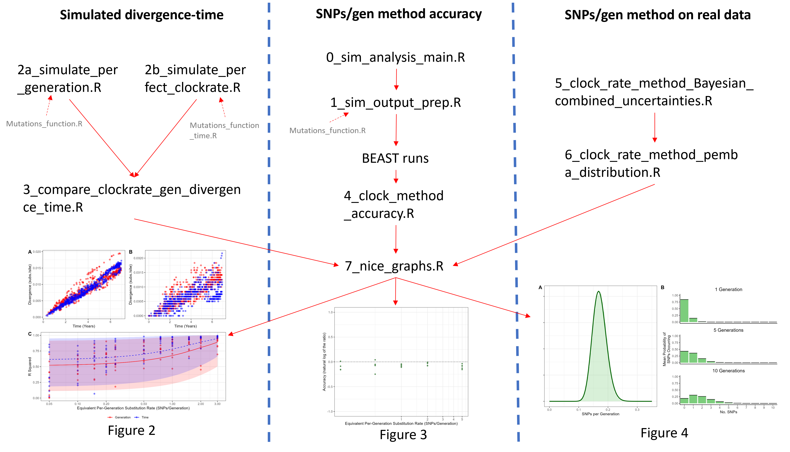

# Rabies Mutation
Creator: Rowan Durrant - School of Biodiversity, One Health & Veterinary Medicine, Glasgow University

Contact me: r.durrant.1@research.ac.uk

Description: Repo for code and data used in the manuscipt "Examining the molecular clock hypothesis for the contemporary evolution of the rabies virus".

## Input
- [EF_simulations](input/EF_simulations) - output from a branching process simulation which we simulate mutations onto.
- [Pemba_assigment.csv](input/Pemba_assignment.csv) - Lineages of each sequence in the Pemba dataset from [Lushasi et al., 2022](https://www.medrxiv.org/content/10.1101/2022.11.24.22282675v1), assigned using [MADDOG](https://github.com/KathrynCampbell/MADDOG).
- [pemba non timescaled.txt](input/pemba non timescaled.txt) - TempEst divergence time plot output for Pemba data
- [pemba_m6_m7.txt](pemba_m6_m7.txt) - log file from Lushasi et al.'s BEAST run
- [pemba_tz_n153.aln.fasta](input/pemba_tz_n153.aln.fasta) - Pemba sequences
- [pemba_tz_n153_timescaled.mcc.tre](input/pemba_tz_n153_timescaled.mcc.tre) - Pemba timescaled tree
- [serial_interval_clean_RD.csv](input/serial_interval_clean_RD.csv) - raw serial interval estimates from [Mancy et al., 2022](https://www.science.org/doi/full/10.1126/science.abn0713?casa_token=f7QDp2hi9VIAAAAA%3ASbD1Sm1BYnB8bPi42OmQ1B5cF5WqDv9hPxQ6QjHMZNB7YE87lpHq6suaqpIZdN8Iw2yGVx6EaedvgUbQ)

## Code: How does rabies mutate? - Figure 2
- [2b_simulate_perfect_clockrate.R](code/2b_simulate_perfect_clockrate.R) takes simulation output and generates mutations onto cases using a clock rate model (mutations accumulate per unit time). Uses [mutations_function_time.R](code/mutations_function_time.R).
- [2a_simulate_per_generation.R](code/2a_simulate_per_generation.R) does the same, but with a per-generation mutation model. Uses [mutations_function.R](code/mutations_function.R).
- [3_compare_clockrate_gen_divergence.R](code/3_compare_clockrate_gen_divergence.R) makes divergence-time plots and compares R^2 values for both per-time and per-generation simulations.
- [7_nice_graphs.R](code/7_nice_graphs.R) - makes graphs

## Code: What is RABV's mutation rate?
### Simulations to test accuracy - Figure 3
- [0_sim_analysis_main.R](code/0_sim_analysis_main.R) - sets up loops for multiple values of mutation rate, seeds etc. Can also be used for above section with some editing
- [1_sim_output_prep.R](code/1_sim_output_prep.R) - takes simulation output and generates mutations onto cases using a clock rate model (mutations accumulate per unit time). Uses [mutations_function.R](code/mutations_function.R).
- [4_clock_method_accuracy.R](code/4_clock_method_accuracy.R) - calculates the SNP/gen prediction method's accuracy.
- [7_nice_graphs.R](code/7_nice_graphs.R) - makes graphs

### Applications to Pemba dataset - Figure 4
- [5_clock_rate_method_bayesian_combine_uncertainties.R](code/5_clock_rate_method_bayesian_combine_uncertainties.R) - calculate SNPs/gen
- [6_clock_rate_method_pemba_distribution.R](code/6_clock_rate_method_pemba_distribution.R) - fits distribution to output.
- [7_nice_graphs.R](code/7_nice_graphs.R) - makes graphs

## Code Flowchart

## Output
- [simulation](output/simulation) - folder with output files relating to all the simulated methods, including divergence-time plot related data and mutation rate calculation method accuracy.
- [pemba](output/pemba) - folder with output files relating to calculating the per-generation substitution rate from real RABV sequences.

## Plots
Files of plots used in the manuscript.

## Communication
Posters and presentations I've used to communicate this project.
